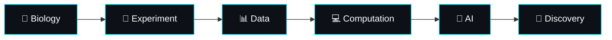

<div align="center">

# KANMANI BHARATHI

### `Researcher` · `Biotechnology` · `Bioinformatics` · `AI`

<p>
  <a href="https://kanmanibharathi.info">
    
  </a>
  <a href="https://linkedin.com/in/kanmani-bharathi-j">
    
  </a>
  <a href="mailto:contact@kanmanibharathi.info">
    
  </a>
</p>


<br>


</div>

---

## `01` — About

> **Turning biological questions into computational solutions.**

I work at the intersection of **plant molecular biology, biotechnology, bioinformatics, scientific data analysis, and software engineering**.

My work spans from **wet-lab experimentation and molecular research** to building modern computational tools that make scientific data analysis faster, reproducible, and accessible.

```text
BIOLOGY
   ↓
EXPERIMENT
   ↓
DATA
   ↓
ANALYSIS
   ↓
INSIGHT
   ↓
DISCOVERY
```

---

## `02` — What I Build

<table>
<tr>
<td width="50%">

### 🧬 Scientific Research

- Plant molecular biology
- Biotechnology
- Tissue culture & micropropagation
- Phytochemistry
- Molecular pharmacology
- Natural product research
- Microbial biotechnology
- Metabolomics

</td>
<td width="50%">

### 💻 Computational Science

- Bioinformatics
- Statistical analysis
- Scientific visualization
- Data analysis platforms
- AI-assisted research tools
- Reproducible workflows
- Research software
- Web-based scientific applications

</td>
</tr>
</table>

---

## `03` — Featured Project

<div align="center">

### 🧪 DATES
#### **Data Analysis Tool for Experimental Statistics**


<br><br>

**A modern platform for experimental data analysis, statistical modelling and scientific visualization.**

<br>

<a href="http://dates.zyndora.in/">
  
</a>

</div>

---

## `04` — Research × Technology



---

## `05` — Technology Stack

<div align="center">

### Languages


### Data · AI · Scientific Computing


### Web · Infrastructure


</div>

---

## `06` — GitHub Analytics

<div align="center">


<br>


</div>

---

## `07` — Current Focus

<div align="center">

| 🔬 Research | 💻 Engineering | 🤖 Future |
|:---:|:---:|:---:|
| Molecular Biology | Scientific Software | AI for Science |
| Biotechnology | Data Platforms | Intelligent Analysis |
| Bioinformatics | Statistical Tools | Research Automation |
| Phytochemistry | Visualization | Computational Biology |

</div>

---

## `08` — Connect

<div align="center">

<a href="https://kanmanibharathi.info">

</a>

<a href="https://linkedin.com/in/kanmani-bharathi-j">

</a>

<a href="mailto:contact@kanmanibharathi.info">

</a>

</div>

<br>

<div align="center">

### `SCIENCE × CODE × DISCOVERY`

*Building tools that make scientific research more powerful.*

<br>


</div>
